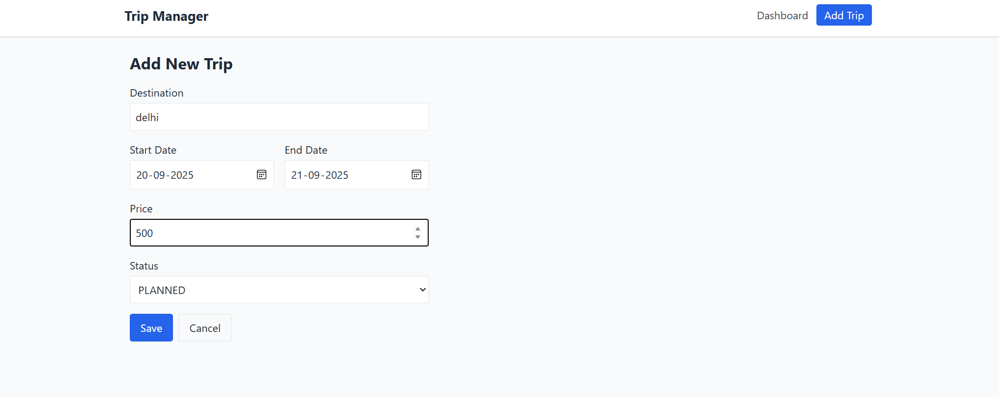
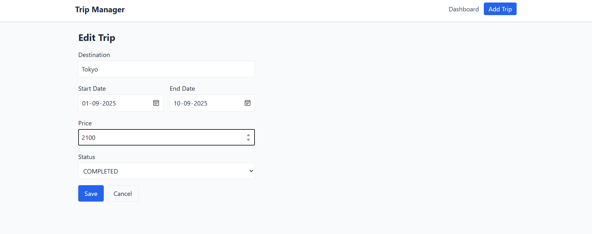
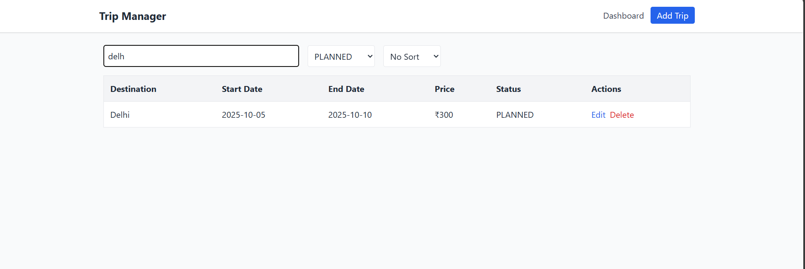
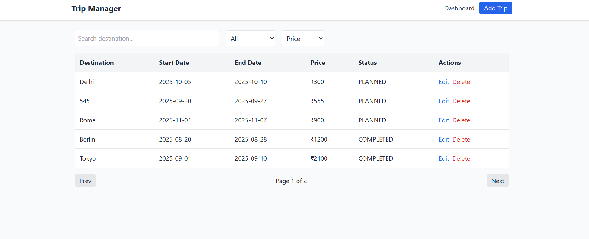
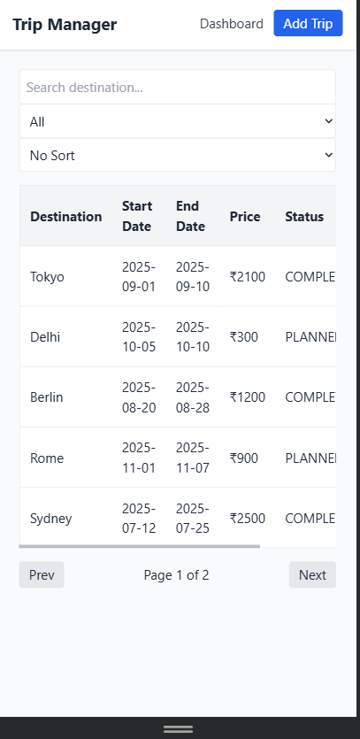
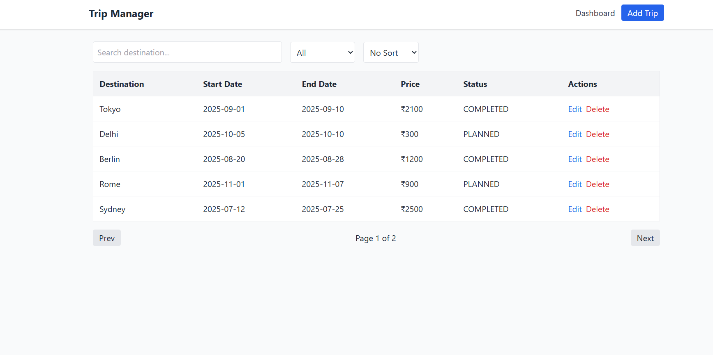
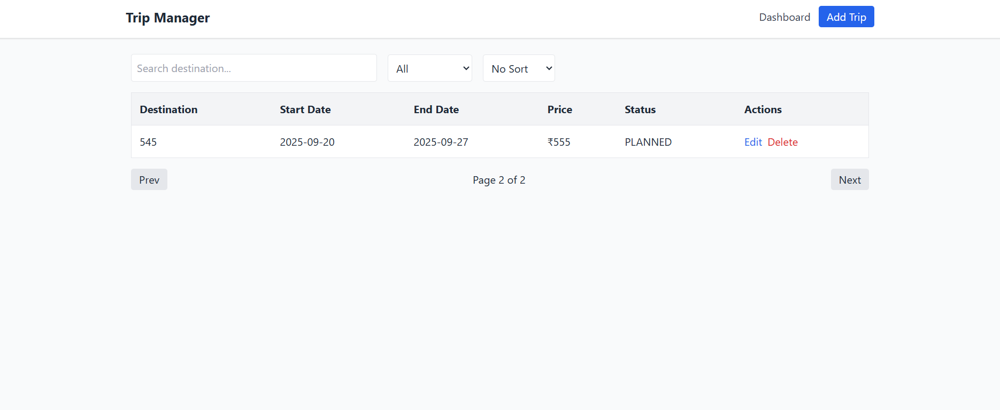

# 🚍 Trip Management System

A React + Vite + Tailwind project that allows users to manage trips with features like Add, Edit, Delete, Search, Filter, Sort, and Pagination.

---

## 🚀 How to Run the Project

1. Clone this repository:
   ```bash
   git clone https://github.com/Sachin06016268/trip-management.git
   

2. Install Dependencies:
npm install

3. Run the development server:
npm run dev

4. Open the app in your browser at:
http://localhost:5173


✨ Features Implemented

1. Dashboard with list of trips
2. Add Trip form (with validation)
3. Edit Trip with pre-filled form
4. Delete Trip with confirmation
5. Search trips by destination
6. Filter trips by status (Planned, Ongoing, Completed)
7. Sort trips by Price or Start Date
8. Pagination for navigating long lists
9. Responsive UI (works on desktop & mobile)
10. LocalStorage persistence (data saved even after refresh)


📸 Screenshots

### Dashboard


### Add Trip


### Edit Trip


### Search & Filter


### Sort


### Responsive (Mobile)


### Pagination

#### Page 1


#### Page 2



🛠️ Tech Stack

1. React 18 + Vite
2. TailwindCSS 3
3. React Router DOM
4. React Hook Form
5. LocalStorage for persistence


